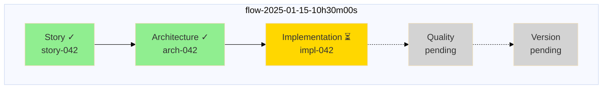
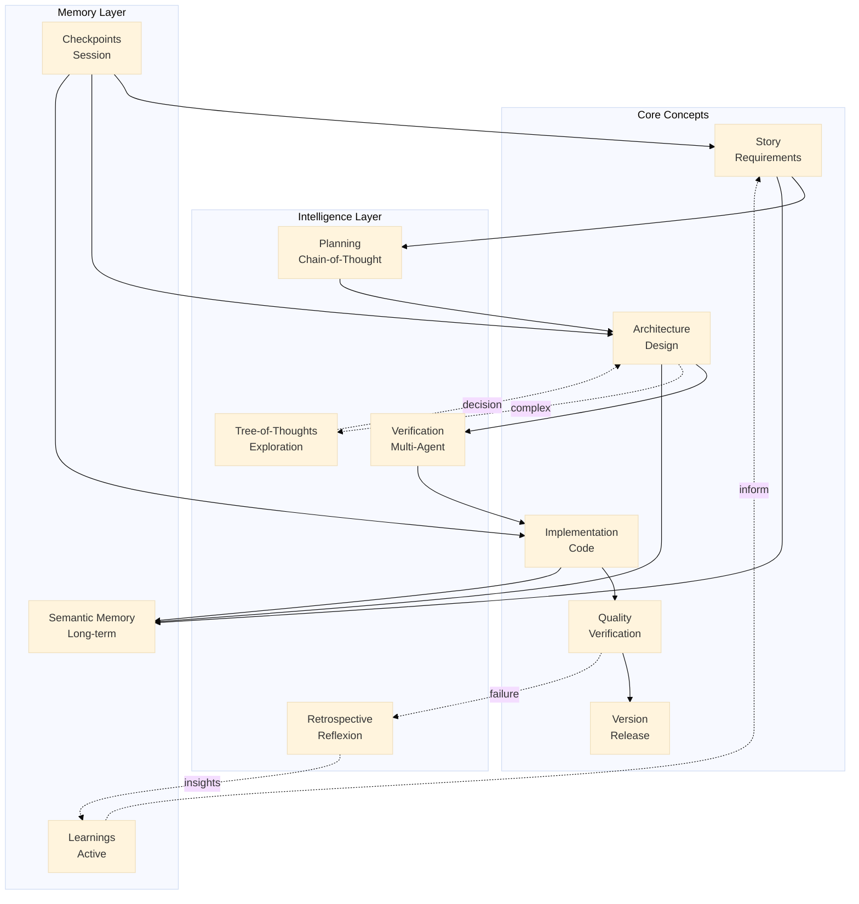

# Visualize Command

Generate visual diagrams from WYSIWID synchronization rules and workflow state.

## Usage

```
/visualize [type] [options]
```

## Types

### `workflow` (default)
Generate a Mermaid flowchart of the synchronization rules.

```
/visualize workflow
```

### `state`
Visualize the current state of a flow.

```
/visualize state flow-2025-01-15-10h30m00s
```

### `concepts`
Show relationships between concepts.

```
/visualize concepts
```

### `memory`
Visualize the memory graph.

```
/visualize memory
```

## Process

When you run this command:

1. **Read Configuration**
   - Load `.claude/synchronizations/*.yaml`
   - Parse sync rules and conditions

2. **Generate Diagram**
   - Convert rules to Mermaid syntax
   - Add styling based on concept types
   - Include conditions as labels

3. **Output**
   - Display Mermaid code block
   - Can be rendered in any Mermaid-compatible viewer

## Example Output

### Workflow Visualization

```mermaid
%%{init: {'theme': 'base', 'themeVariables': { 'primaryColor': '#4a90d9'}}}%%
flowchart LR
    subgraph Capture
        S[Story<br/>Opus]
    end

    subgraph Design
        P[Planning<br/>Opus]
        A[Architecture<br/>Opus]
    end

    subgraph Build
        I[Implementation<br/>Opus]
    end

    subgraph Verify
        V1[Verification 1<br/>Opus]
        V2[Verification 2<br/>Opus]
        VC[Consensus<br/>Opus]
    end

    subgraph Quality
        QR[Review<br/>Opus]
        QT[Test<br/>Opus]
    end

    subgraph Release
        VE[Version<br/>Opus]
    end

    subgraph Learn
        R[Retrospective<br/>Opus]
    end

    S -->|"ready & complex"| P
    S -->|"ready & simple"| A
    P -->|"ready"| A
    A -->|"risk != low"| V1
    A -->|"risk == low"| I
    V1 --> V2
    V2 --> VC
    VC -->|"approved"| I
    VC -->|"blocked"| A
    I --> QR & QT
    QR & QT -->|"passed"| VE
    QR -->|"rejected"| R
    QT -->|"failed"| R
    R -.->|"learnings"| S

    class sonnet fill:#90EE90
    classDef sonnet fill:#87CEEB
    classDef opus fill:#DDA0DD

    class sonnet
    class P,V1,V2,R sonnet
    class A opus
```

### State Visualization



### Concepts Visualization



## Styling Guide

| Concept | Color | Model |
|---------|-------|-------|
| Story | Green | Opus |
| Architecture | Purple | Opus |
| Implementation | Green | Opus |
| Quality | Green | Opus |
| Version | Green | Opus |
| Planning | Blue | Opus |
| Verification | Blue | Opus |
| Retrospective | Blue | Opus |

## Integration

The visualizations can be:
1. Displayed in the terminal (as Mermaid code)
2. Rendered in VS Code with Mermaid extension
3. Exported to PNG/SVG using mermaid-cli
4. Embedded in documentation

## Automatic Updates

When sync rules change, re-run `/visualize workflow` to see the updated flow.
This ensures the diagram always matches the actual behavior (WYSIWID).
